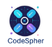



**UNIVERSIDAD PRIVADA DE TACNA**

**FACULTAD DE INGENIERÍA**

**Escuela Profesional de Ingeniería de Sistemas**

` `**Plataforma de Monitoreo y Análisis del Mercado Laboral en Ingeniería de Sistemas**

Curso: Inteligencia de Negocios

Docente: Mag. Patrick Cuadros Quiroga

Integrantes:

Daleska Nicolle Fernandez Villanueva            (2021070308)

Andree Sebastian Flores Melendez                (2017057494)

Mario Antonio Flores Ramos                           (2018000597)

**Tacna – Perú**

**2025**

**Plataforma de Monitoreo y Análisis del Mercado Laboral en Ingeniería de Sistemas**

**Informe de Factibilidad**

**Versión 1.0**

|CONTROL DE VERSIONES||||||
| :-: | :- | :- | :- | :- | :- |
|Versión|Hecha por|Revisada por|Aprobada por|Fecha|Motivo|
|1\.0|MPV|ELV|ARV|10/10/2020|Versión Original|

**ÍNDICE GENERAL**

[1.	Descripción del Proyecto	3](#_iv6xus1gaq4u)

[2.	Riesgos	3](#_1juzuhf6bxil)

[3.	Análisis de la Situación actual	3](#_yhjyw2p9wdje)

[4.	Estudio de Factibilidad	3](#_do0ca12nms0o)

[4.1	Factibilidad Técnica	4](#_3kfy02pbq1be)

[4.2	Factibilidad económica	4](#_c3dyc56ucrnj)

[4.3	Factibilidad Operativa	4](#_wodyuog7awjy)

[4.4	Factibilidad Legal	4](#_nbh8o08h6g1h)

[4.5	Factibilidad Social	5](#_1ao4clyctamc)

[4.6	Factibilidad Ambiental	5](#_m66n4ec2aiez)

[5.	Análisis Financiero	5](#_iuly1z74mzj)

[6.	Conclusiones	5](#_2uqq6locaqdb)

**Informe de Factibilidad**

1. Descripción del Proyecto
   1. Nombre del proyecto

Plataforma de Monitoreo y Análisis del Mercado Laboral en Ingeniería de Sistemas

1. Duración del proyecto

6 meses (desde la fase de análisis hasta la implementación y prueba del sistema)

1. Descripción 

Este proyecto tiene como objetivo crear una plataforma web que permita analizar el mercado laboral en la carrera de Ingeniería de Sistemas. La idea es que estudiantes, egresados y profesionales puedan ver qué empleos están disponibles, qué tecnologías están siendo más utilizadas, y qué habilidades buscan las empresas actualmente. Así, podrán saber en qué deben especializarse, qué aprender y cómo mejorar su perfil para conseguir mejores oportunidades de trabajo. Además, la plataforma también será útil para universidades, que podrán adaptar sus cursos a lo que realmente 

se necesita en el mundo laboral. Las empresas también podrán usar la herramienta para entender mejor el mercado y mejorar cómo contratan nuevos talentos

1\.4 Objetivos

`       `1.4.1 Objetivo general

Desarrollar una aplicación web moderna e intuitiva que permita a estudiantes, egresados y profesionales de Ingeniería de Sistemas visualizar y analizar de manera clara y accesible la demanda laboral actual, ayudándoles a identificar oportunidades de empleo y prepararse mejor para el mercado

`        `1.4.2 Objetivos Específicos

● Recopilar información actualizada de distintas fuentes confiables sobre las ofertas laborales disponibles para profesionales de Ingeniería de Sistemas.

● Analizar y mostrar los datos de forma interactiva, utilizando estadísticas y comparaciones que faciliten la comprensión de las tendencias laborales, las habilidades más solicitadas y los cambios en la demanda del mercado.

● Mantener la aplicación siempre actualizada, integrando de forma constante nuevas tendencias, tecnologías emergentes y las necesidades cambiantes del mercado laboral, asegurando que la información sea útil y actual.

1. Riesgos

● Dependencia de fuentes de datos externas: La calidad de la información depende de portales de empleo y su disponibilidad.

● Precisión de datos: Posibles inconsistencias si las fuentes no son actualizadas.

● Sobrecarga del servidor: Riesgo de baja capacidad ante muchos usuarios concurrentes.

● Cumplimiento legal: Necesidad de respetar la Ley de Protección de Datos Personales.

1. Análisis de la Situación actual
   1. Planteamiento del problema

      Existe una brecha entre la formación académica de los estudiantes de Ingeniería de Sistemas y las demandas reales del mercado laboral. Muchos profesionales carecen de información sobre las habilidades requeridas, salarios, ubicaciones con alta demanda, lo que genera desempleo o subempleo. No hay actualmente una herramienta específica que analice el mercado de forma integral para este campo.

1. Consideraciones de hardware y software

   Para el desarrollo y prueba de la plataforma web de monitoreo y análisis del mercado laboral, se utilizarán 3 computadoras con las siguientes características

   Hardware:

   ● Procesador: Intel Core i5 de octava generación o superior, adecuado para tareas de programación, análisis de datos y pruebas del sistema, asegurando fluidez y rapidez en el desarrollo.

   ● Sistema Operativo: Windows 10 o versiones más recientes. Para el alojamiento en servidores, se recomienda utilizar Linux (si el proveedor de hosting lo permite), ya que ofrece mayor estabilidad, seguridad y un menor costo operativo.

   ● Memoria RAM: 16 GB DDR4, lo que permite ejecutar sin problemas herramientas de desarrollo, servidores locales, entornos de prueba y múltiples aplicaciones al mismo tiempo.

   ● Accesorios: Monitor, teclado y mouse estándar serán suficientes para llevar a cabo las tareas de desarrollo, diseño y pruebas funcionales de la plataforma.

   Software:

   ● Lenguaje de programación: Se empleará C# como lenguaje principal, junto con el framework ASP.NET Core para desarrollar el backend de la aplicación. Para la parte visual (frontend), se utilizarán tecnologías web como HTML, CSS y JavaScript, lo que permitirá crear una interfaz moderna, interactiva y fácil de usar desde cualquier dispositivo.

   ● Base de datos: La información sobre ofertas de empleo, habilidades demandadas y usuarios se almacenará en una base de datos SQL Server, estructurada para garantizar eficiencia en la consulta y manejo de los datos.

   ● Entorno de desarrollo: Se trabajará con Visual Studio, un entorno robusto que ofrece todas las herramientas necesarias para programar en C#, gestionar la base de datos y realizar pruebas

1. Estudio de Factibilidad

   El estudio de factibilidad de la plataforma web para monitoreo y análisis del mercado laboral en Ingeniería de Sistemas permitió evaluar si el proyecto puede desarrollarse y funcionar correctamente desde los aspectos técnico, económico y operativo. Se revisaron los recursos disponibles, los costos estimados, y los requisitos tecnológicos necesarios, considerando herramientas de programación como C#, ASP.NET Core y SQL Server, además de analizar el equipo informático disponible y los gastos operativos asociados al uso de servidores y mantenimiento. Tras este análisis, se concluyó que el proyecto es viable y puede ejecutarse con éxito, siempre que se gestionen adecuadamente los recursos y se mantenga actualizado el sistema.

1. Factibilidad Técnica
- Hardware: Se utilizarán computadoras de gama media con procesadores Intel Core i5 o superior y al menos 8 GB de RAM, suficientes para programar, hacer pruebas y administrar la plataforma de manera fluida.

- Servidor en la nube: Se necesitará un servidor con almacenamiento en la nube para guardar y acceder de forma segura a los datos recolectados, permitiendo acceso remoto para los desarrolladores y usuarios autorizados.

- Software: El sistema será desarrollado en C#, utilizando el framework ASP.NET Core para la parte lógica (backend) y HTML, CSS y JavaScript para la interfaz web (frontend), creando una experiencia interactiva y fácil de usar.

- Visualización y exportación de datos: Se usarán herramientas compatibles con PDF, Excel y JSON para que los usuarios puedan ver y descargar reportes de manera sencilla.

- Base de datos: Se implementará SQL Server para almacenar de forma eficiente las ofertas laborales, habilidades demandadas, estadísticas y perfiles de usuario.

1. Factibilidad Económica

   Se evaluaron los costos relacionados con el desarrollo, puesta en marcha y mantenimiento continuo de la plataforma web para el análisis del mercado laboral en Ingeniería de Sistemas, concluyendo que el proyecto es viable y sostenible económicamente. A continuación, se presentan los principales gastos asociados a su creación y funcionamiento

1. Costos Generales 

|**Concepto**|**Cantidad**|**Costo unitario (S/)**|**Subtotal (S/)**|
| :-: | :-: | :-: | :-: |
|Computadoras para desarrollo|3|2,500|7,500|
|Licencias de software|0|0|0|
|Material de oficina (papelería, impresora, tinta)|-|500|500|
|**Total**|||8,000|

1. Costos operativos durante el desarrollo 

|**Concepto**|**Cantidad**|**Costo Mensual (S/)**|**Total (S/) (6 meses)**|
| :-: | :-: | :-: | :-: |
|Servicios básicos (agua, luz, internet)|1|300|1,800|
|Servidor en la nube|1|250|1,500|
|**Total**|||3,300|

1. Costos del ambiente

|**Concepto**|**Costos (S/)**|
| :-: | :-: |
|Hosting|250|
|Dominio web (.com o .org)|100|
|Infraestructura de red (router, cableado)|400|
|**Total**|750|

1. Costos de personal

|Rol|**Cantidad**|**Salario Mensual (S/)**|**Duración (Mensual)**|**Subtotal (S/)**|
| :-: | :-: | :-: | :-: | :-: |
|Desarrollador Backend|1|1,000|6|6,000|
|Desarrollador Frontend|1|1,200|6|7,200|
|Analista de Requerimientos|1|1,000|6|6,000|
|**Total**||||19,200|

1. Costos totales del desarrollo del sistema

|**Categoría**|**Costos Total (S/)**|
| :-: | :-: |
|Costos generales|8,000|
|Costos operativos|3,300|
|Costos del ambiente|750|
|Costos de personal|19,200|
|**Total**|31,250|

1. Factibilidad Operativa

   El sistema está pensado para ser fácil de usar, con una interfaz intuitiva y amigable. Cualquier persona podrá entrar desde su navegador y acceder a la información sin necesidad de descargar nada. Además, tendrá filtros, comparaciones y gráficos para facilitar la experiencia. Se actualizará frecuentemente para mantener todo al día, lo que garantiza que pueda operar bien por mucho tiempo.

1. Factibilidad Legal

   El proyecto será desarrollado respetando las leyes vigentes, en especial la Ley de Protección de Datos Personales (Ley N° 29733 - Perú). Solo se usará información que sea pública o que los usuarios entreguen de forma voluntaria. Además, la plataforma contará con políticas de privacidad claras para proteger los datos personales y garantizar un uso legal de toda la información.

1. Factibilidad Social

   El impacto social es muy positivo. Ayudará a que más estudiantes y egresados puedan encontrar trabajo en su área, conociendo mejor qué habilidades deben aprender y en qué lugares hay más oportunidades. También ayudará a que las universidades mejoren sus planes de estudio y que las empresas contraten personal más capacitado. En general, busca mejorar la empleabilidad y apoyar el crecimiento profesional.

1. Factibilidad Ambiental
- Uso eficiente de energía: La plataforma digitaliza procesos de análisis y consulta de información laboral, lo que evita actividades presenciales y reduce el uso excesivo de recursos físicos, optimizando así el consumo energético.
- Optimización del almacenamiento digital: La información se gestionará en la nube de forma organizada y sin duplicados, permitiendo un mejor uso del espacio en servidores y evitando el consumo innecesario de recursos tecnológicos.
- Fomento de la conciencia ambiental: Al utilizar esta plataforma digital, los usuarios fortalecen su conciencia ecológica, promoviendo el uso responsable de herramientas tecnológicas y la reducción del impacto ambiental en sus actividades educativas y profesionales.

1. Análisis Financiero
   1. Justificación de la Inversión
      1. Beneficios del Proyecto

El desarrollo de una plataforma web para monitorear y analizar el mercado laboral en Ingeniería de Sistemas ofrece múltiples beneficios, tanto tangibles como intangibles, que contribuirán directamente a mejorar la toma de decisiones de egresados o estudiantes.

**Beneficios Tangibles**:

- Acceso rápido a información laboral actualizada: Gracias a la infraestructura escalable en la nube, la plataforma puede almacenar y procesar grandes cantidades de datos de manera eficiente, proporcionando información precisa y en tiempo real.
- Ahorro de tiempo en la búsqueda de empleo: El uso de tecnología en la nube permite un procesamiento más rápido y ágil de los datos, lo que se traduce en una experiencia de usuario más eficiente y en tiempo real.
- Mejora en la planificación académica: La infraestructura en la nube proporciona la flexibilidad para manejar datos grandes y complejos, lo que permite que las universidades ajusten sus planes de estudio en base a datos del mercado laboral de forma dinámica.
- Análisis de tendencias y habilidades demandadas: La base de datos SQL en la nube asegura que los datos se mantengan actualizados y sean fácilmente accesibles, lo que permite realizar análisis en tiempo real sobre las tendencias y habilidades más demandadas en el mercado laboral.

**Beneficios Intangibles:**

- Mayor orientación profesional: La plataforma, respaldada por una infraestructura en la nube fiable y escalable, asegura que los egresados y estudiantes puedan acceder a datos relevantes y fiables, lo que les permite tomar decisiones profesionales informadas.
- Confianza en los datos: La infraestructura en la nube garantiza que los datos se mantengan seguros, sean accesibles y actualizados, lo que fomenta la confianza en los resultados de la plataforma.
- Impulso a la mejora continua: Gracias a la capacidad de la nube para almacenar y procesar grandes volúmenes de datos, la plataforma puede evolucionar constantemente, adaptándose a los cambios del mercado y mejorando de manera continua.

5\.1.2 Criterios de Inversión

5\.1.2.1 Relación Beneficio/Costo (B/C)

**Egresos:**

Gastos operacionales como parte del funcionamiento del software en producción.

|**Gasto**|**pu**|**cantidad**|**subtotal**|
| :- | :- | :- | :- |
|**Infraestructura cloud**|259|1|259|
|**Especialista cloud**|400|1|400|
|**Base de datos SQL en la nube (infraestructura)**|0\.93|1|0\.93|
|**Desarrollador**|350|1|350|
|** | | |1009\.93|
|**Total de egresos**||x 12 meses|S/ 12,119.16|

**Ingresos anuales estimados:**

|**Aumento de ingresos (Estimado por aumento en demanda) (25%)**|** |**3500**|
| :- | :- | -: |
|**Reducción en costos operativos (por eficiencia) 20%**| |10940|
|**Ahorro en infraestructura (por migración a la nube o mejoras) 15%**| |21100|
|**Ingreso total anual**| |S/ 35,540.00|

**Tabla de Flujo de Caja y Evaluación Financiera del Proyecto**

|**inversión**|**S/ 31,250.00**|**PPTO DEL PY**|**TASA DESCTUENTO**|**9%**|
| :- | -: | :- | :- | -: |
||||||
|**Periodo**|Ingreso|Egreso|flujo efectivo||
|**0**| | |-31250||
|**1**|35540|12119\.16|23420\.84||
|**2**|25540|12119\.16|13420\.84||
|**3**|25540|12119\.16|13420\.84||
||||||
|**VAN**|S/. 43,146.41|**S/. 11,896.41**|||
|**TIR**||**32%**|||
|**INDICE DE RENTABILIDDAD (b/c)**||**S/. 1.38**|||

**VAN positivo (S/ 11,896.41):** El proyecto es rentable, ya que genera un excedente por encima de la inversión inicial y la tasa de descuento (9%).

**TIR alta (32%):** Supera ampliamente el costo de oportunidad (9%), lo que confirma su viabilidad financiera.

**Índice de Rentabilidad (1.38):** Por cada sol invertido, se recupera S/ 1.38, reforzando su atractivo económico.

**Conclusión:** La inversión es viable y recomendable bajo estos indicadores.

\*                    5.1.2.2 Valor Actual Neto (VAN)

` `**VAN (Valor Actual Neto):** El análisis del VAN, calculado en S/ 11,896.41, demuestra que el proyecto es financieramente viable, al superar la tasa de descuento del 9% y generar un retorno positivo sobre la inversión inicial de S/ 31,250.00. Esto se alinea con la TIR del 32%, indicando una alta rentabilidad.

5\.1.2.3 Tasa Interna de Retorno (TIR)

La TIR del 32% no solo confirma la viabilidad del proyecto, sino que su amplio margen sobre la tasa de descuento (9%) sugiere un bajo riesgo financiero. Este resultado, junto al VAN positivo y un Índice de Rentabilidad de 1.38, justifica la implementación de la inversión

1. Conclusiones

**VIABILIDAD FINANCIERA COMPROBADA**

El proyecto demuestra rentabilidad económica con un VAN positivo de S/ 11,896.41, una TIR del 32% que supera ampliamente la tasa de descuento del 9%, y un Índice de Rentabilidad de 1.38, confirmando que genera valor para los inversionistas.

**ALTA RENTABILIDAD Y SOSTENIBILIDAD**

La significativa diferencia entre la TIR (32%) y la tasa mínima requerida (9%) garantiza un amplio margen de seguridad, asegurando la sostenibilidad del proyecto incluso ante posibles fluctuaciones del mercado.

**EFICIENCIA EN EL USO DE RECURSOS**

El análisis de flujos de caja evidencia una estructura financiera eficiente, con capacidad para generar retornos positivos desde el primer año y mantener una trayectoria de crecimiento constante durante el período evaluado.

**BAJO RIESGO OPERATIVO**

Los indicadores financieros, respaldados por proyecciones conservadoras, sugieren un perfil de riesgo controlado, con capacidad para absorber variaciones moderadas en los costos operativos o ingresos.

**RECOMENDACIÓN DE IMPLEMENTACIÓN**

Considerando los resultados del análisis financiero, técnico y de mercado (según corresponda), se recomienda la ejecución del proyecto, estableciendo un sistema de monitoreo periódico para garantizar el cumplimiento de las proyecciones y la rentabilidad esperada.

**OBSERVACIÓN FINAL:**

El proyecto cumple con todos los criterios de evaluación económica y financiera establecidos, demostrando ser una inversión segura y rentable bajo las condiciones actuales del mercado. Se sugiere implementar los controles de gestión necesarios para optimizar su desempeño operativo y financiero durante la etapa de ejecución.

2

