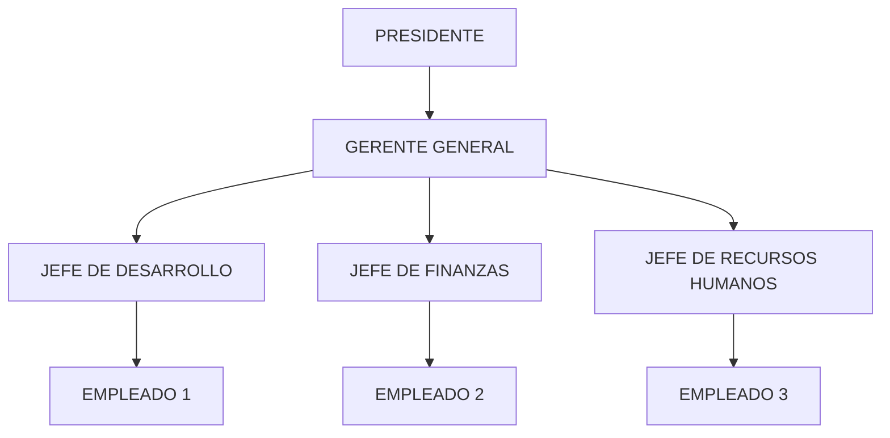
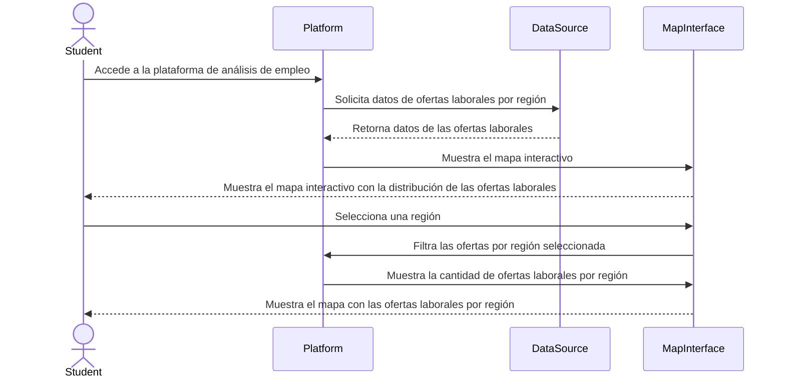
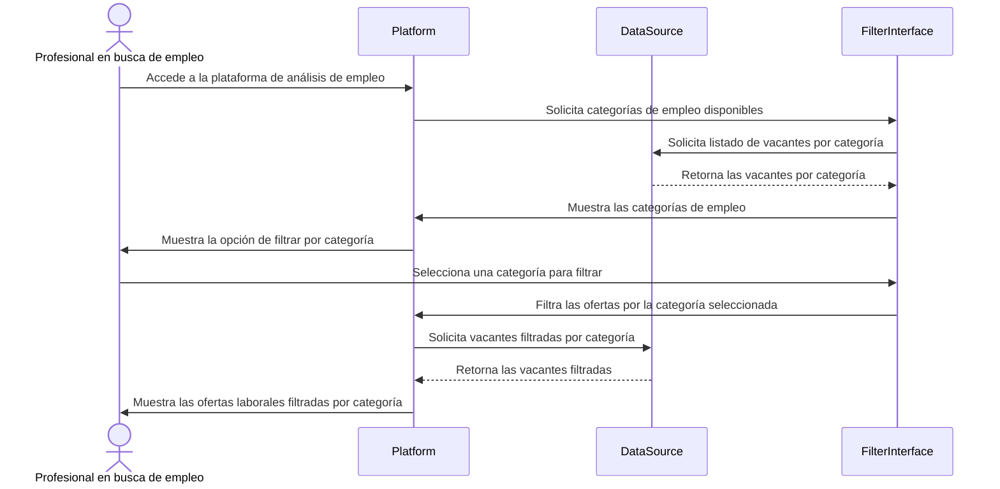
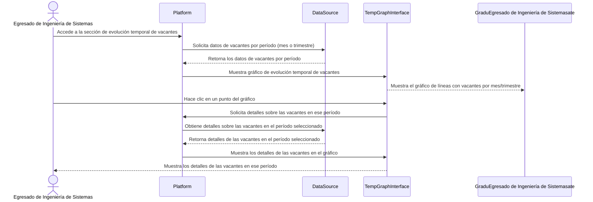
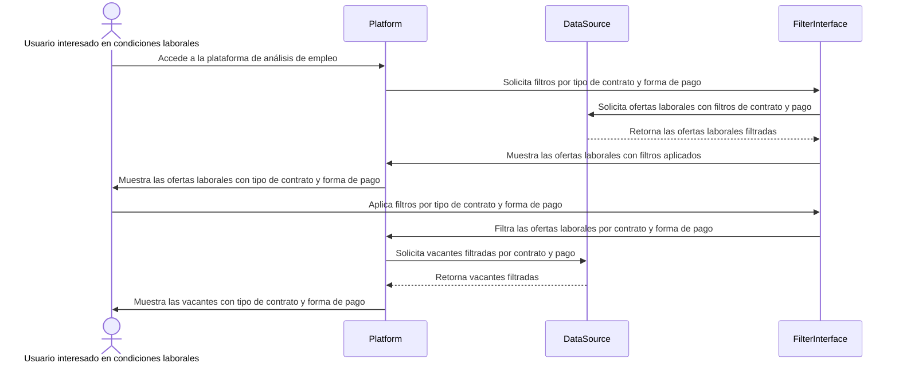
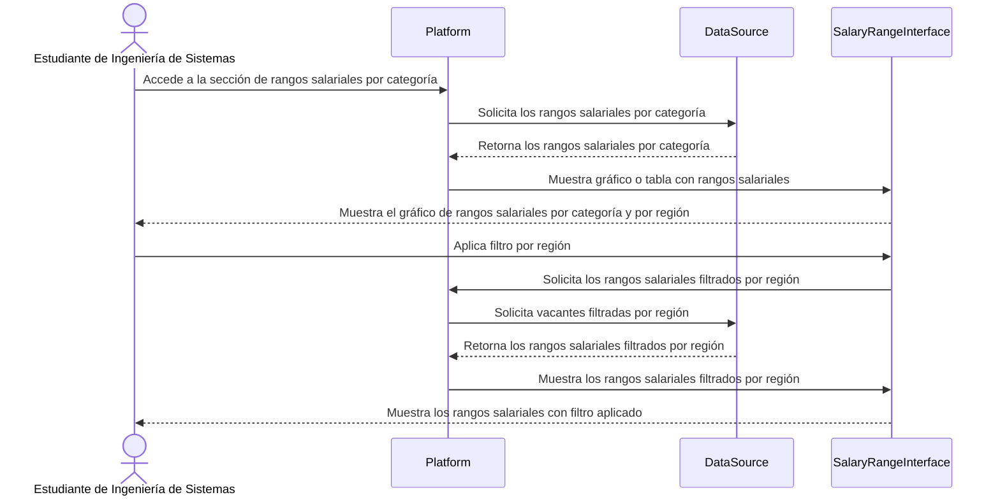
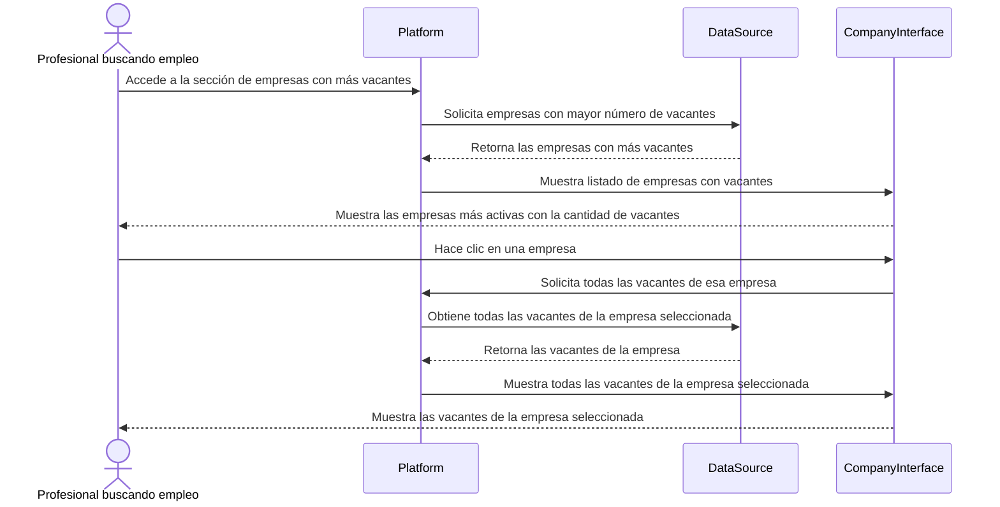

# UNIVERSIDAD PRIVADA DE TACNA

## FACULTAD DE INGENIERÍA

### Escuela Profesional de Ingeniería de Sistemas

---

### Plataforma de Análisis del Mercado Laboral en Ingeniería de Sistemas

**Curso**: Inteligencia de Negocios  
**Docente**: Mag. Patrick Cuadros Quiroga

---

#### Integrantes:
- Daleska Nicolle Fernandez Villanueva (2011070308)
- Andree Sebastian Flores Melendez (2017057494)
- Mario Antonio Flores Ramos (2018000597)

---

Tacna – Perú  
2025

---

## CONTROL DE VERSIONES

| Versión | Hecha por | Revisada por | Aprobada por | Fecha       | Motivo          |
|---------|-----------|--------------|--------------|-------------|-----------------|
| 1.0     | DFV       | AF           | MF           | 28/04/2025  | Versión Original |

---

# Plataforma De Análisis del Mercado Laboral en Ingeniería de Sistemas  
## Documento de Especificación de Requerimientos de Software

### Versión 1.0

---

## CONTROL DE VERSIONES

| Versión | Hecha por | Revisada por | Aprobada por | Fecha       | Motivo          |
|---------|-----------|--------------|--------------|-------------|-----------------|
| 1.0     | DFV       | AF           | MF           | 10/10/2020  | Versión Original |

---

## ÍNDICE GENERAL

1. **INTRODUCCIÓN** 4  
2. **I. Generalidades de la Empresa**  
    - 1. Nombre de la Empresa 
    - 2. Visión 
    - 3. Misión 
    - 4. Organigrama  
3. **II. Visionamiento de la Empresa**
    - 1. Descripción del Problema 
    - 2. Objetivos de Negocios 
    - 3. Objetivos de Diseño  
    - 4. Alcance del proyecto  
    - 5. Viabilidad del Sistema   
    - 6. Información obtenida del Levantamiento de Información   
4. **III. Análisis de Procesos** 
    - 1. Diagrama del Proceso Actual – Diagrama de actividades 
    - 2. Diagrama del Proceso Propuesto – Diagrama de actividades Inicial 
5. **IV. Especificación de Requerimientos de Software** 
    - 1. Cuadro de Requerimientos funcionales Inicial 
    - 2. Cuadro de Requerimientos No funcionales 
    - 3. Cuadro de Requerimientos funcionales Final  
    - 4. Reglas de Negocio   
6. **V. Fase de Desarrollo** 
    - 1. Perfiles de Usuario  
    - 2. Modelo Conceptual 
        - a. Diagrama de Paquetes 
        - b. Diagrama de Casos de Uso  
        - c. Escenarios de Caso de Uso (narrativa) 
    - 3. Modelo Lógico 
        - a. Analisis de Objetos 
        - b. Diagrama de Actividades con objetos  
        - c. Diagrama de Secuencia 
        - d. Diagrama de Clases 
7. **CONCLUSIONES** 
8. **RECOMENDACIONES**  
9. **BIBLIOGRAFÍA** 
10. **WEBGRAFÍA** 

---

## INTRODUCCIÓN

## I. Generalidades de la Empresa

### 1. Nombre de la Empresa

El nombre de la empresa es **IngeTrack**.

### 2. Visión

Convertirse en la plataforma de referencia para el análisis del mercado laboral en Ingeniería de Sistemas, proporcionando información actualizada sobre tendencias, oportunidades y habilidades demandadas. Con ello, ayudará a estudiantes, profesionales y universidades a tomar decisiones estratégicas para su desarrollo en el sector.

### 3. Misión

Desarrollar una plataforma que recopile, analice y presente información sobre el mercado laboral en ingeniería de sistemas a través del uso de datos actualizados y herramientas de análisis. Identificará oportunidades de empleo y permitirá conocer las habilidades más valoradas, contribuyendo al crecimiento profesional y académico de sus usuarios.

### 4. Organigrama

---

## II. Visionamiento de la Empresa

### 1. Descripción del Problema

Existe una brecha significativa entre la formación académica de los estudiantes de Ingeniería de Sistemas y las demandas reales del mercado laboral. Muchos profesionales egresan sin contar con información detallada sobre las habilidades más requeridas, los rangos salariales y las ubicaciones con mayor demanda de empleo en su campo. Esta falta de conocimiento contribuye al desempleo o subempleo, dificultando la inserción laboral y el crecimiento profesional. Actualmente, no existe una herramienta específica que analice de manera integral el mercado laboral para la Ingeniería de Sistemas, lo que impide que los estudiantes y profesionales tomen decisiones informadas sobre su desarrollo profesional.

### 2. Objetivos de Negocios

Desarrollar una plataforma web que permita el análisis de tendencias del mercado laboral en Ingeniería de Sistemas, facilitando a estudiantes, egresados y profesionales la identificación de oportunidades de empleo y la mejora de su preparación en función de las demandas del sector.

### 3. Objetivos de Diseño

- **Diseño centrado en el usuario**: Crear una interfaz intuitiva y atractiva que facilite la navegación y el acceso a la información relevante.
- **Experiencia multiplataforma**: Asegurar la compatibilidad con dispositivos móviles, tabletas y computadoras de escritorio mediante un diseño responsivo.
- **Estructura modular y escalable**: Implementar una arquitectura flexible que permita la expansión y mejora del sistema con nuevas funcionalidades.
- **Interacción eficiente y atractiva**: Utilizar gráficos interactivos, animaciones y visualizaciones de datos para mejorar la experiencia del usuario.
- **Optimización del rendimiento**: Minimizar tiempos de carga y mejorar la eficiencia del sistema mediante técnicas de optimización y almacenamiento en caché.
- **Seguridad y protección de datos**: Aplicar medidas de seguridad avanzadas, como cifrado de datos y autenticación robusta, para garantizar la protección de la información de los usuarios.
- **Accesibilidad e inclusión**: Cumplir con estándares de accesibilidad web para garantizar que el sistema sea usable por personas con diferentes capacidades.
- **Diseño adaptable y personalizable**: Permitir la personalización de la interfaz según las preferencias y necesidades de los usuarios.

### 4. Alcance del Proyecto

El sistema proporcionará un análisis detallado del mercado laboral en Ingeniería de Sistemas a través de una aplicación web. Entre sus principales funcionalidades se incluyen:
- Recopilación y análisis de datos de ofertas de empleo en Ingeniería de Sistemas.
- Visualización de tendencias de empleo en gráficos y estadísticas.
- Filtros avanzados para búsquedas personalizadas por tecnologías, experiencia y ubicación.
- Comparador de habilidades del usuario con las demandas del mercado.

### 5. Viabilidad del Sistema

El sistema es totalmente viable porque se puede desarrollar con las tecnologías y conocimientos actuales. Su implementación requiere inversión en servidores y mantenimiento, además de ser una herramienta útil para estudiantes, profesionales y universidades, ya que les permitirá acceder a información clave sobre el mercado laboral. Solo será necesario asegurarse de cumplir con las normas de protección de datos para garantizar la seguridad y legalidad de la información.

### 6. Información obtenida del Levantamiento de Información

A través del levantamiento de información, se identificó que estudiantes, profesionales y universidades necesitan acceder a datos actualizados sobre el mercado laboral en Ingeniería de Sistemas. Para ello, se recopilaron datos de portales de empleo, redes profesionales y encuestas a empresas, lo que permitió conocer las tendencias y habilidades más demandadas. También se detectó que muchas personas tienen dificultades para encontrar información clara y herramientas especializadas. Por esta razón, la plataforma incluirá funciones como búsqueda de empleos, análisis de tendencias y generación de reportes, asegurando que sea compatible y fácil de usar.

---

## III. Análisis de Procesos

### 1. Diagrama del Proceso Actual – Diagrama de actividades

### 2. Diagrama del Proceso Propuesto – Diagrama de actividades Inicial

---

## IV. Especificación de Requerimientos de Software

### 1. Cuadro de Requerimientos funcionales Inicial

### 2. Cuadro de Requerimientos No funcionales

### 3. Cuadro de Requerimientos funcionales Final

| **ID** | **Historia de Usuario**                                        | **Como (Rol)**                                      | **Deseo**                                                                 | **Para**                                                                                                    | **Criterio de Aceptación**                                                                                                                                           |
|--------|---------------------------------------------------------------|----------------------------------------------------|---------------------------------------------------------------------------|-------------------------------------------------------------------------------------------------------------|---------------------------------------------------------------------------------------------------------------------------------------------------------------------|
| 1      | Visualizar de Distribución Geográfica de las Ofertas Laborales | Como estudiante o egresado de Ingeniería de Sistemas | Quiero ver un mapa interactivo con la distribución geográfica de las ofertas de empleo | Para que pueda identificar en qué departamentos o regiones del Perú hay mayor demanda de profesionales de mi área | El mapa debe mostrar los departamentos con el mayor número de ofertas.   El mapa debe permitir el filtrado por región o departamento.   Los usuarios deben poder ver la cantidad de ofertas laborales en cada región al hacer clic sobre ella. |
| 2      | Filtrar por Categorías de Empleo                              | Como profesional que busca empleo                  | Quiero filtrar las ofertas laborales según categorías específicas (desarrolladores de software, analistas de sistemas, etc.) | Para que pueda acceder rápidamente a las vacantes que se ajusten a mis habilidades y especialización. | La plataforma debe permitir filtrar por categorías de empleo.   Debe mostrar el número total de vacantes en cada categoría.   Los filtros deben ser fáciles de aplicar y actualizar. |
| 3      | Analizar de la Evolución Temporal de las Vacantes             | Como egresado de Ingeniería de Sistemas             | Quiero visualizar la evolución temporal de las vacantes                    | Para que pueda identificar tendencias en la demanda de empleo a lo largo del tiempo y planificar mi desarrollo profesional en función de ello | Los usuarios deben poder ver un gráfico de líneas que muestre cómo han cambiado las vacantes a lo largo de los meses o trimestres.   El gráfico debe permitir ver las vacantes por categoría y por tipo de contrato.   Los usuarios deben poder hacer clic en cada punto del gráfico para obtener detalles sobre las vacantes en ese período. |
| 4      | Comparar tipos de Contrato y Formas de Pago                    | Como usuario interesado en las condiciones laborales | Quiero comparar las ofertas laborales según el tipo de contrato y forma de pago | Para que pueda seleccionar las ofertas que se ajusten a mis preferencias de trabajo y condiciones salariales | La plataforma debe permitir filtrar por tipo de contrato y forma de pago.   Los usuarios deben poder ver un resumen de las vacantes con sus respectivas condiciones.   Debe haber una visualización clara de las diferencias entre las distintas ofertas laborales en términos de contrato y forma de pago. |
| 5      | Estudiar Rangos Salariales por Categoría                       | Como estudiante de Ingeniería de Sistemas            | Quiero ver un análisis de los rangos salariales por categoría de empleo     | Para que pueda tener una idea clara de las expectativas salariales en el mercado laboral y planificar mi carrera profesional | Los usuarios deben poder ver un gráfico o tabla con rangos salariales promedio por categoría.   Debe haber filtros para ver los rangos salariales por diferentes regiones.   Los rangos salariales deben ser visualizados de forma comparativa para facilitar la decisión. |
| 6      | Detectar Empresas con Mayor Actividad Contratante              | Como profesional buscando oportunidades              | Quiero ver un listado de las empresas con mayor número de vacantes          | Para que pueda identificar las empresas más activas en la contratación de profesionales de Ingeniería de Sistemas y aplicar a las vacantes correspondientes | La plataforma debe listar las empresas con el mayor número de ofertas.   Debe mostrar el número de vacantes disponibles por empresa.   Los usuarios deben poder hacer clic en cada empresa para ver todas las vacantes abiertas. |
| 7      | Actualizar Automáticamente Datos del Mercado laboral           | Como administrador de la plataforma                 | Quiero que la plataforma se actualice automáticamente con datos nuevos sobre las ofertas laborales | Para que los usuarios siempre tengan acceso a la información más actualizada sin necesidad de intervención manual | Los datos sobre vacantes deben actualizarse automáticamente desde las fuentes externas cada determinado tiempo (por ejemplo, cada 24 horas).   Los usuarios deben recibir una notificación cuando los datos se actualicen. |

### 4. Reglas de Negocio

---

## V. Fase de Desarrollo

### 1. Perfiles de Usuario

### 2. Modelo Conceptual

- **Diagrama de Paquetes**
- **Diagrama de Casos de Uso**
- **Escenarios de Caso de Uso (narrativa)**

### 3. Modelo Lógico

- **Análisis de Objetos**
- **Diagrama de Actividades con objetos**
- **Diagrama de Secuencia**

Visualizar distribución Geográfica de las Ofertas Laborales

Filtrar por Categorías de Empleo

Analizar evolución Temporal de las Vacantes

Comparar tipos de Contrato y Formas de Pago

Estudiar Rangos Salariales por Categoría

Detectar Empresas con Mayor Actividad Contratante

- **Diagrama de Clases**

---

## CONCLUSIONES

## RECOMENDACIONES

## BIBLIOGRAFÍA

## WEBGRAFÍA

