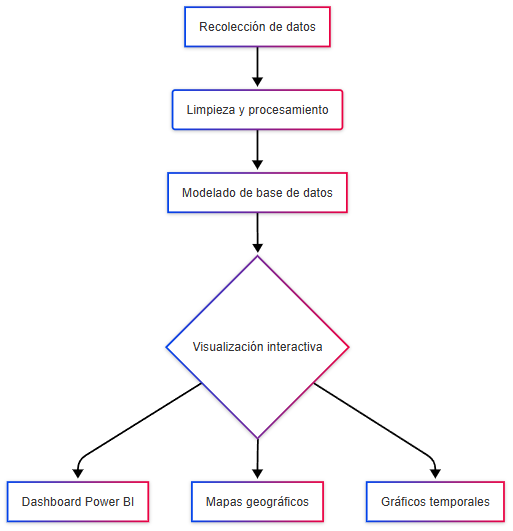

# 🎯 Panorama del Mercado Laboral en Perú
### Dashboard Interactivo para Toma de Decisiones

---

## 🎯 Objetivo Principal

**Analizar el panorama del mercado laboral peruano mediante:**

- Distribución geográfica de ofertas
- Segmentación sectorial del empleo
- Herramienta interactiva para usuarios
- Visualización intuitiva de datos

---

## ✅ Objetivos Secundarios

1. 🔍 Identificar departamentos con mayor oferta
2. 📊 Evaluar categorías con más publicaciones
3. 📈 Analizar evolución temporal de vacantes
4. 🤝 Comparar tipos de contrato y pago
5. 💰 Estudiar rangos salariales por categoría
6. 🏢 Detectar empresas más activas

---

## 📊 Metodología de Análisis

---
## 🚀 Diagrama de Infraestructura

<!-- COMENTARIO: Imagen desde URL -->

---

## 🗄️ Diagrama de Base de Datos

<!-- COMENTARIO: Imagen desde URL -->